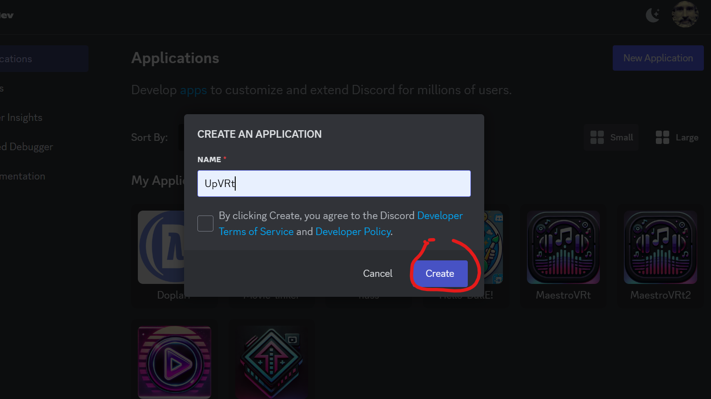
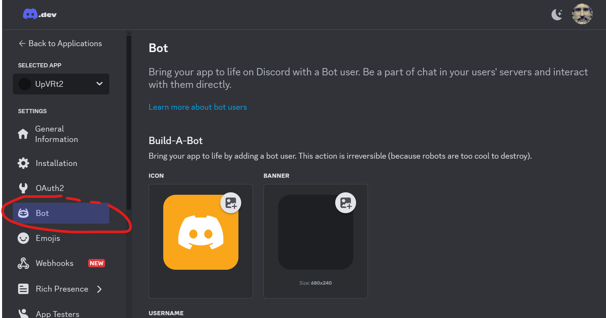
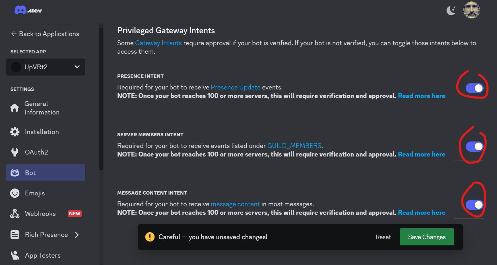
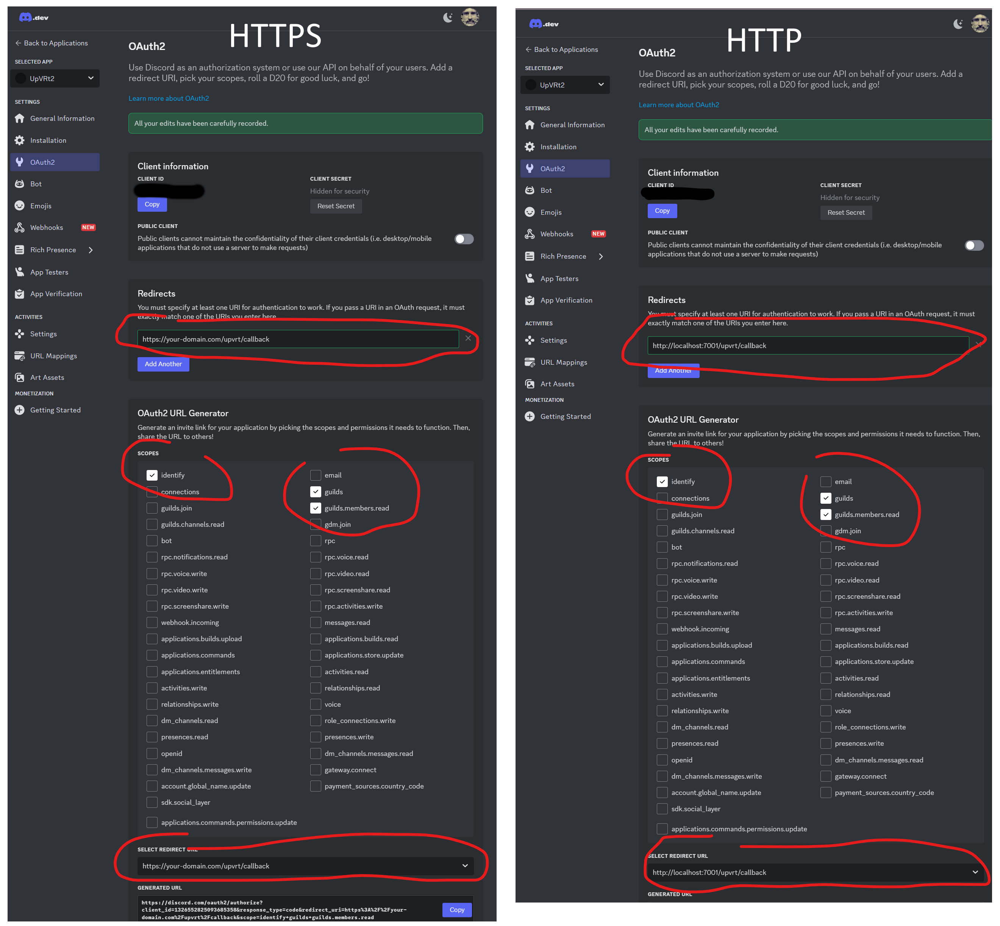
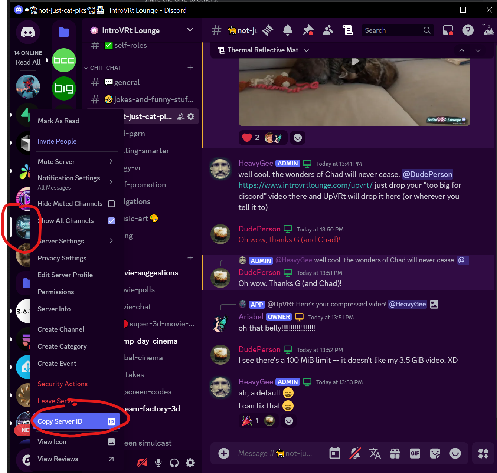

# UpVRT - Discord Video Upload Tool

[](https://github.com/HeavyGee/upvrt/actions/workflows/test.yml)
[](https://github.com/HeavyGee/upvrt/actions/workflows/docker.yml)
[](https://hub.docker.com/r/heavygee/upvrt)

A tool for automatically compressing and uploading videos to Discord while maintaining quality under Discord's file size limits.

## Requirements

### Hosting
- For local development/testing: Can run on localhost
- For production deployment: 
  - Requires a host with a public IP address
  - HTTPS is required for Discord OAuth2 in production
  - Common options: VPS, cloud service (AWS, GCP, DigitalOcean, etc.), or your own server

## Installation Options

### Docker (Recommended)
```bash
docker pull heavygee/upvrt:latest
docker run -d \
  -p 7001:7001 \
  --name upvrt \
  -v /path/to/your/videos:/app/uploads \
  --env-file .env \
  heavygee/upvrt:latest
```

For Docker Compose setup, see our [Docker Hub page](https://hub.docker.com/r/heavygee/upvrt).

### Manual Installation
1. Install system dependencies:
   ```bash
   # Ubuntu/Debian
   sudo apt-get update && sudo apt-get install -y ffmpeg python3.11 python3.11-venv

   # macOS
   brew install ffmpeg python@3.11

   # Windows
   choco install ffmpeg python311
   ```

2. Set up Python environment:
   ```bash
   python3.11 -m venv venv
   source venv/bin/activate  # Linux/macOS
   # or
   .\venv\Scripts\activate  # Windows
   ```

3. Install Python dependencies:
   ```bash
   pip install -r requirements.txt
   ```

4. Configure environment (see Configuration section below)

5. Run the application:
   ```bash
   gunicorn --bind 0.0.0.0:7001 wsgi:app
   ```

## Configuration

### Environment Variables
Copy `.env.example` to `.env` and configure the following variables:

#### Required Discord Configuration
- `DISCORD_CLIENT_ID`: Your Discord application's client ID
- `DISCORD_CLIENT_SECRET`: Your Discord application's client secret
- `DISCORD_REDIRECT_URI`: OAuth2 redirect URI (default: http://localhost:7001/upvrt/callback)
- `DISCORD_BOT_TOKEN`: Your Discord bot's token
- `GUILD_ID`: Your Discord server's ID
- `APPLICATION_ID`: Same as your DISCORD_CLIENT_ID
- `PUBLIC_KEY`: Your Discord application's public key

#### Optional Configuration
- `TARGET_SIZE_MB`: Target size for compressed videos (default: 9.5MB)
- `MAX_UPLOAD_SIZE_MB`: Maximum upload size allowed (default: 1000MB)

## Discord Bot Setup

Follow these steps to set up your Discord bot:

### 1. Create New Application
1. Go to [Discord Developer Portal](https://discord.com/developers/applications)
2. Click "New Application" and name it (e.g., "UpVRT")



### 2. Create Bot
1. Navigate to the "Bot" section in the left sidebar
2. Click "Add Bot" and confirm



### 3. Configure Bot Permissions
Under the bot settings, enable the following Privileged Gateway Intents:
- Message Content Intent
- Server Members Intent
- Presence Intent



### 4. Collect Required Keys
You'll need to gather the following values from the Discord Developer Portal:

- **DISCORD_CLIENT_ID**: Found in General Information > Application ID
- **DISCORD_CLIENT_SECRET**: Found in OAuth2 > Client Secret (Reset if needed)
- **APPLICATION_ID**: Same as your Client ID
- **PUBLIC_KEY**: Found in General Information > Public Key
- **DISCORD_BOT_TOKEN**: Found in Bot > Token (Reset if needed)

### 5. Configure OAuth2
1. Go to OAuth2 > General
2. Add your redirect URI:
   - For local development: `http://localhost:7001/upvrt/callback`
   - For production: `https://your-domain.com/upvrt/callback` (must be HTTPS)
3. Save Changes
4. In the "Scopes" section, select:
   - `identify` (required to get user info)
   - `guilds` (required to list user's servers)
   - `guilds.members.read` (required to verify server membership)
5. Select your callback URL from the list - copy it, use it to invite the Bot to your server.



### 6. Get Your Server ID
1. Enable Developer Mode in Discord (User Settings > App Settings > Advanced)
2. Right-click your server name and select "Copy ID"



## License

MIT License - see the [LICENSE](LICENSE) file for details. 